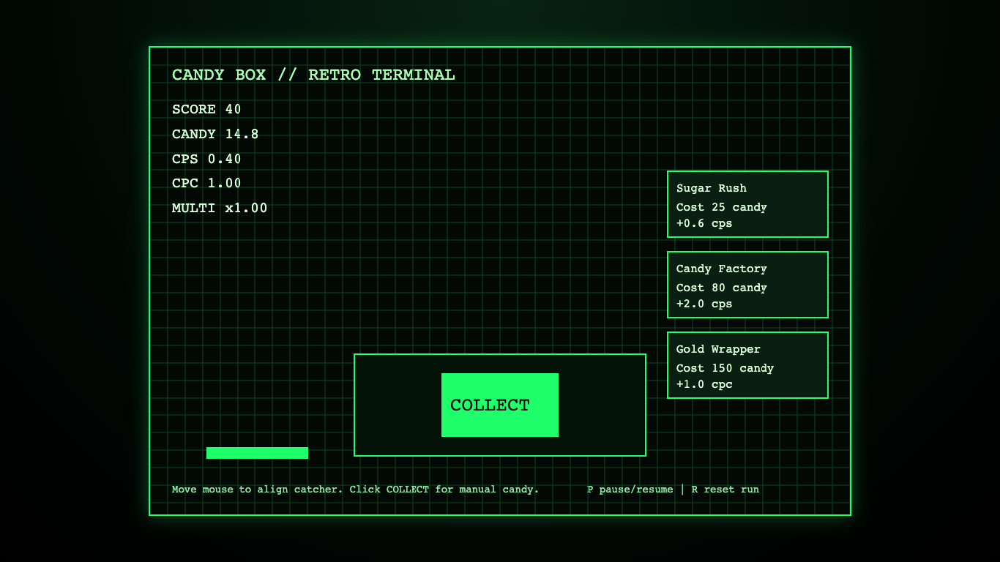

# daily-classic-game-2026-02-21-candy-box-retro-terminal

<p align="center">
  <strong>Retro-terminal Candy Box idle clicker with deterministic bonus catch collisions.</strong>
</p>

<p align="center">
  
</p>

## GIF Captures
### Start and First Collection
<p align="center">
  
</p>

### Bonus Hit Cycle
<p align="center">
  
</p>

### Bonus Miss Reset
<p align="center">
  
</p>

## Quick Start
```bash
pnpm install
pnpm dev
pnpm test
pnpm build
```

## How To Play
- Click `START RUN`.
- Click the `COLLECT` button to gain candy and score.
- Move the mouse horizontally to position the catcher bar.
- Catch orange bonus candy to increase multiplier.
- Buy upgrades from the right panel to improve `cps` and `cpc`.
- Controls:
- `P`: pause/resume.
- `R`: reset run.

## Rules
- Passive candy is generated continuously using `candiesPerSecond`.
- Bonus candy spawns on a deterministic cycle and falls toward the catcher lane.
- Catching a bonus increases multiplier and grants score.
- Missing a bonus resets multiplier to `x1.00`.
- Session ends at 120 seconds elapsed.

## Scoring
- Manual collection: `candiesPerClick * multiplier` converted to score.
- Bonus catch grants immediate score and candy boost.
- Multiplier increases by `+0.5` per catch up to `x5.0`.
- Miss resets multiplier.

## Twist
- `retro terminal colors` applied across HUD, panels, and grid styling.
- High-contrast green-on-black visuals with amber bonus candy callouts.

## Verification
```bash
pnpm test
pnpm build
WEB_GAME_URL="http://127.0.0.1:4173/?scripted_demo=1" node scripts/capture_playwright.mjs
```

Deterministic artifacts:
- `playwright/main-actions/state-2.json` shows passive growth and first bonus hit event.
- `playwright/main-actions/state-4.json` shows miss cycle and multiplier reset.

Browser hooks:
- `window.advanceTime(ms)`
- `window.render_game_to_text()`

## Project Layout
```text
src/
  constants.ts
  types.ts
  rng.ts
  game.ts
  input.ts
  render.ts
  main.ts
scripts/
  self_check.mjs
  capture_playwright.mjs
playwright/
  main-actions/
assets/
  gifs/
docs/plans/
```
