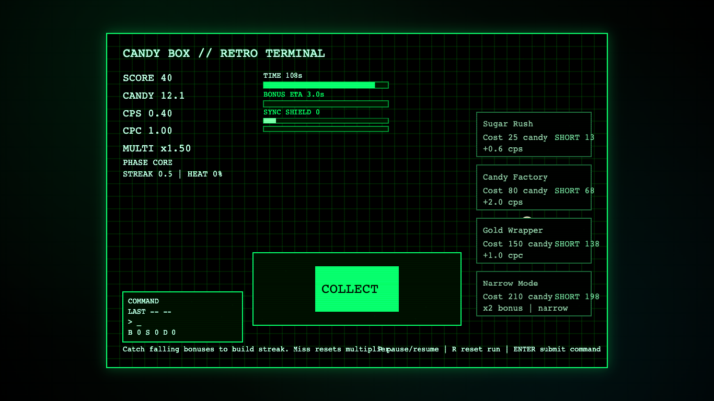
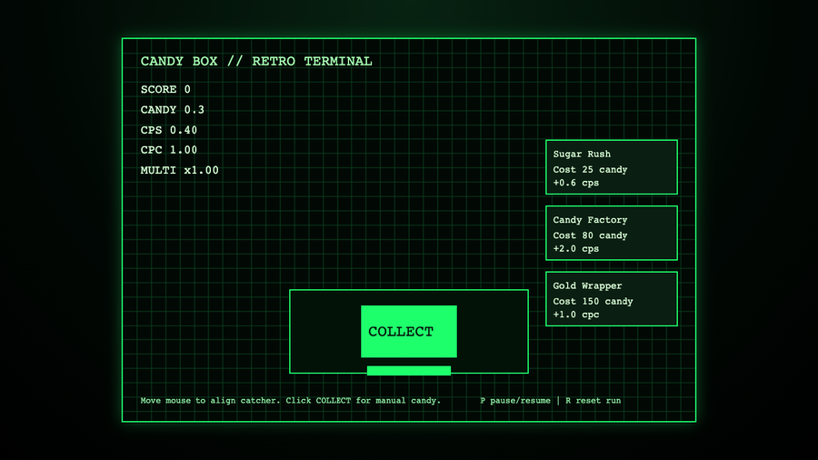
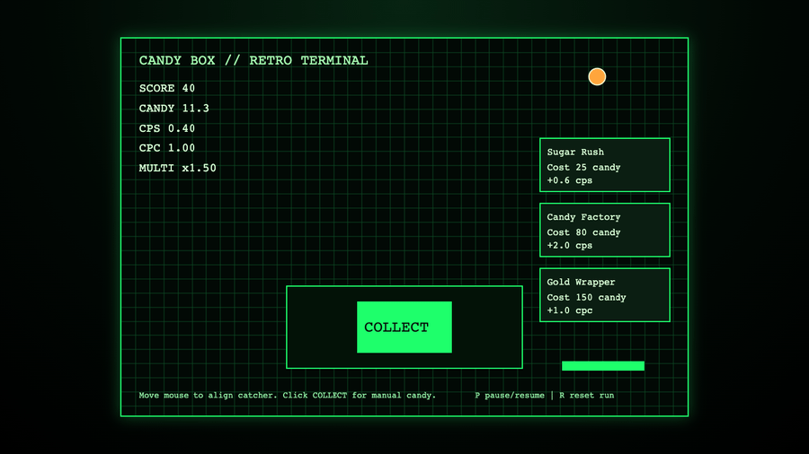

# daily-classic-game-2026-02-21-candy-box-retro-terminal

Deterministic retro-terminal candy clicker with streak/heat risk loop, difficulty modes, and prestige meta-progression.

<p align="center">
  
</p>

## GIF Highlights

### Boot + Early Loop
<p align="center">
  
</p>

### Bonus Catch Cycle
<p align="center">
  
</p>

### Miss + Recovery Flow
<p align="center">
  
</p>

## Quick Start
```bash
pnpm install
pnpm dev
pnpm test
pnpm build
```

## How To Play (Quick Tutorial)
1. Start a run (`Start` button or `Enter`) and keep the catcher under falling candy.
2. Press `Space` or `Collect` to generate manual candy and score.
3. Catch falling bonuses to grow streak and multiplier; misses reset multiplier unless shielded.
4. Buy run upgrades from the right dock while the run is active.
5. Use terminal commands (`BOOST`, `SYNC`, `DUMP`) from the left dock command input.
6. At game over, spend prestige chips on permanent upgrades, then restart.

## Controls
- Move catcher: mouse / touch drag / `ArrowLeft` / `ArrowRight` / `A` / `D`
- Manual collect: `Space` or `Collect`
- Pause: `P`
- Reset run: `R`
- Toggle docks: `Q` (left), `E` (right)
- Theme quick keys: `1` classic, `2` amber, `3` blue vector

## Difficulty Modes
| Difficulty | Runtime | Spawn Interval | Fall Speed | Miss Recovery | Economy Scale | Chip Scale |
| --- | ---: | ---: | ---: | ---: | ---: | ---: |
| Easy | 300s | 3400ms | 120 | 3000ms | x1.12 gains / x0.90 costs | x0.85 |
| Medium | 240s | 2800ms | 145 | 4500ms | x1.00 gains / x1.00 costs | x1.00 |
| Hard | 180s | 2200ms | 180 | 6000ms | x0.92 gains / x1.18 costs | x1.35 |

## Prestige / Meta Progression
- Chips are awarded at game over and persist between runs.
- Chip formula:
- `base = floor(score/900 + catches/6 + bestStreak/2)`
- `chips = max(1, floor(base * difficultyChipMultiplier))`
- Permanent upgrades:
- `manual_core`: +0.15 CPC/rank (max 5)
- `passive_core`: +0.12 CPS/rank (max 5)
- `catcher_rails`: +8px catcher width/rank (max 4)
- `heat_sink`: -8% heat gain/rank (max 4)
- `recovery_patch`: -10% miss-recovery/rank (max 4)
- `command_bus`: -12% command cooldown/rank (max 3, rank 3 grants +1 starting shield)

## Commands
- `BOOST`: temporary click power burst.
- `SYNC`: adds shield and clears active recovery penalty.
- `DUMP`: converts part of current run momentum into score.

## Browser Hooks
- `window.advanceTime(ms)`
- `window.render_game_to_text()`

Snapshot payload includes:
- run/difficulty: `mode`, `phase`, `difficulty`, `runDurationMs`
- score loop: `score`, `candies`, `candiesPerSecond`, `candiesPerClick`, `multiplier`, `streak`, `heat`
- timing: `timeLeftMs`, `nextSpawnMs`, `recoveryMs`, `blueSlowMs`, `redBoostMs`, `warningActive`
- state objects: `bonusTarget`, `stats`, `scoreBreakdown`, `command`, `meta`, `chipsEarnedThisRun`
- layout/debug: `playfieldRect`, `uiPanelsOpen`, `pendingEvents`

## Determinism + Verification
```bash
pnpm test
pnpm build
WEB_GAME_URL="http://127.0.0.1:4173/?scripted_demo=1" node scripts/capture_playwright.mjs
```

Deterministic mode notes:
- `scripted_demo=1` runs with meta-progression disabled for reproducible snapshots.
- In scripted demo, realtime animation loop is disabled; state advances only via `window.advanceTime(ms)`.

Evidence files:
- `playwright/main-actions/state-0.json`
- `playwright/main-actions/state-4.json`
- `playwright/main-actions/state-7.json`
